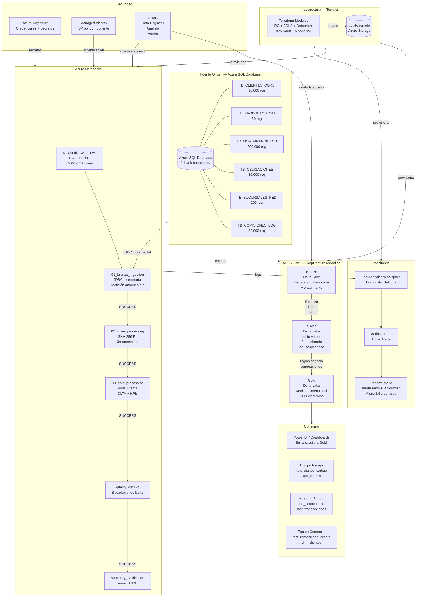

## Descripción de la arquitectura

### Flujo de datos

1. **Fuente:** Azure SQL Database actúa como sistema origen. Los datos sintéticos se generan con Python y se cargan mediante `load_to_sql.py`.

2. **Bronze:** El notebook `01_bronze_ingestion.py` lee desde SQL via JDBC con paralelismo de 8 particiones. Agrega columnas de auditoría (_ingestion_timestamp, _source_system, _batch_id), particiona por año/mes/día y escribe en Delta Lake. El modo incremental usa watermarks persistidos en `bronze/_control/watermarks`.

3. **Silver:** El notebook `02_silver_processing.py` aplica seis transformaciones en orden: deduplicación, validación de nulos obligatorios, integridad referencial (rechazados a tabla de errores), estandarización de tipos, enmascaramiento SHA-256 de PII y cálculo de ind_sospechoso con ventana estadística de 30 días.

4. **Gold:** El notebook `03_gold_processing.py` construye 4 dimensiones y 4 tablas de hechos/KPIs con reglas de negocio específicas de FinBank (bucket_mora, provisiones regulatorias, CLTV 12 meses).

5. **Orquestación:** Databricks Workflows ejecuta el DAG  con dependencias estrictas SUCCESS-only, 3 reintentos con backoff y notificación automática al finalizar.

### Decisiones de arquitectura

- **Delta Lake sobre Parquet plano:** aporta transacciones ACID, soporte de MERGE para idempotencia, versionado y viajes en el tiempo sin overhead operacional significativo.
- **Managed Identity + Key Vault:** ninguna credencial aparece en código fuente ni en variables de entorno sin cifrar. Todos los secretos se resuelven en tiempo de ejecución.
- **Databricks Workflows sobre Apache Airflow:** integración nativa con el workspace, sin infraestructura adicional que mantener, monitoreo incluido en la UI de Databricks.
- **Terraform con módulos separados:** permite reutilizar la infraestructura en múltiples entornos (dev/prod) con un solo comando y sin duplicar código.
